# Boardgame Buddy

### This site is designed as a Boardgame information resource, and personal boardgame-collection manager. 
This project is intended for users of any age. It is developed using a mobile first approach and is fully responsive. The project aims to meet high standards of accessibility requirements. 

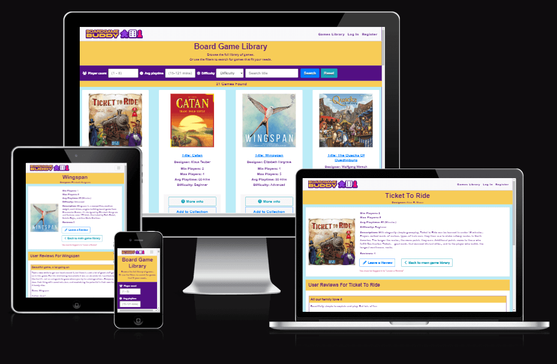

## [Click here to deploy this project live](https://boardgame-buddy-c89ff5d28931.herokuapp.com/)

**PLEASE NOTE: This documentation contains many images which can be viewed via a dropdown toggle.**

## Table of Contents
* [**Planning and Development**](#planning-and-development)
    * [***Target Users***](#target-users)
    * [***User Stories***](#user-stories)
    * [***Site Objectives***](#site-objectives)
    * [***Approach***](#approach)
    * [***Research***](#research)
    * [***Data Schema***](#data-schema)
    * [***Wireframes***](#wireframes)
    * [***Colour Scheme***](#colour-scheme)
    * [***Typography***](#typography)
* [**Features**](#features)
* [**Future Features**](#future-features)
* [**Testing**](#testing)
  * [Go to TESTING.md](TESTING.md)
* [**Deployment**](#deployment)
  * [Click here to deploy this project live](/https://boardgame-buddy-c89ff5d28931.herokuapp.com/)
* [**Languages**](#languages)
* [**Frameworks and Tools**](#frameworks-and-tools)
* [**Software**](#software)
* [**Imported Code**](#imported-code)
* [**Credits**](#credits)
* [**Thanks**](#thanks)

[**Back to top**](#boardgame-buddy)

## Planning and Development
### Target Users
- Users of all age groups.
- Users who want to find introductory info about different Board Games.
- Users who want fast and easily accessible game information.
- Users who want peer recommendations on Board Games.
- Users who want to filter a game library according to their needs.
- Users who want to contribute more games and reviews to the site.
- Users who want to be able to create and manage a collection of their own games.

### User Stories
1. As a budding board gamer, I want to quickly find introductory information on lots of different Board Games.
2. As a user, I want to have a positive user experience.
3. As a user, I want the site to be intuitive and easy to navigate.
4. As a user, I want to use the site across multiple devices.
5. As a busy adult planning a Board Game night with friends, I want to be able to quickly search for games that will meet my group's needs.
6. As Board Game fanatic, I want to document and manage my game collection. 
7. As a differently abled user, I want the product to be accessible.

### Site Objectives
1. To provide a positive user experience.
2. To create an intuitive UI that provides good site flow.
3. To build a family-friendly product.
4. To deliver a game that is responsive on a large variety of screen sizes and mobile devices.
5. To create a fast, reliable site that can fetch a lot of information quickly and display it clearly.
6. To allow users to create their own profiles, with log in functionality that is secure.
7. To give users the functionality to update their own profile.
7. To provide functionality for users to build their own game collection (and delete collection games too)
8. To allow users to add and share more games to the main library.
9. To allow users to create and delete their own reviews on games.
10. To provide a design that appeals to typically geeky/retro fanatical individuals. 

### Approach
- Mobile first design.
- The site functionality will be provided to the user logically and intuitively.
- The site will be created following the principles of user experience design.
- The content of the site will be inoffensive and accessible to all.
- Clean, professional design, with consistent colour-scheme, style and layouts throughout.

### Research
The following sites were examined as part of my project research:
- https://boardgamegeek.com/
- https://www.board-game.co.uk/
- https://theboardgamehut.co.uk/

Common themes found:
  - Responsive design.
  - Neutral backgrounds to page styling.
  - Massive amounts of info on the screen that could be overwhelming to the user.

My adjustments to suit my project aims:
  - Reduce info on the main library page to what's essential.
  - Give full page space to a single game when the user wants more info.
  - No auto play music that can reduce a user's positive UX.

[**Back to top**](#boardgame-buddy)
### Data Schema

This was the original data schema as part of early development. Some features and pages have been edited or removed entirely to meet project deadlines. Following MOSCOW prioritisation (Must-have, Should-have, Could-have, Won't-have)

Original Data Schema

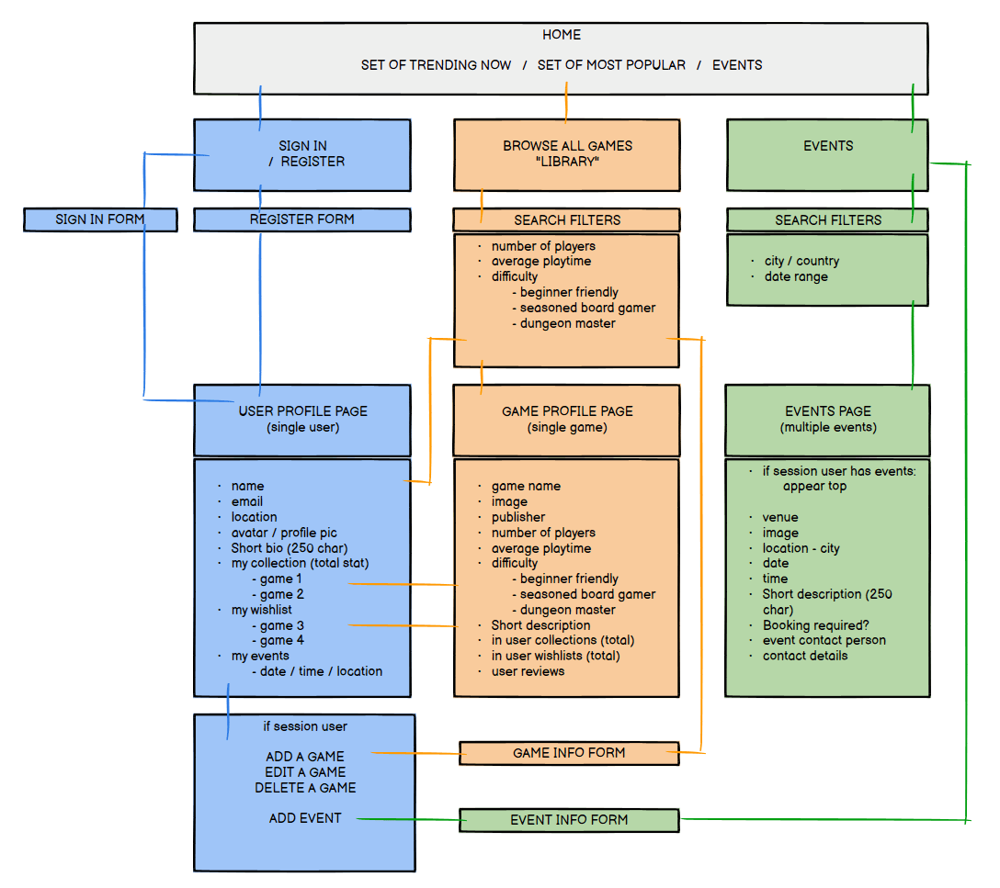

Revised Data Schema after MOSCOW prioritisation

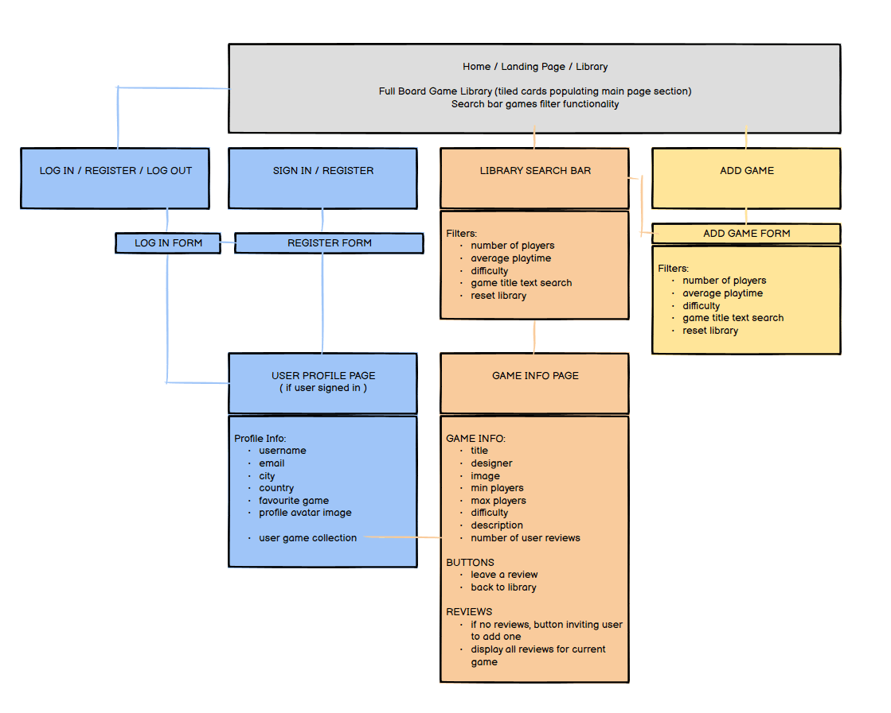

### Wireframes

Balsamiq was used to create initial layouts and wireframes.
Some features and pages have been edited or removed entirely to meet project deadlines. Following MOSCOW prioritisation (Must-have, Should-have, Could-have, Won't-have)

Please toggle the following dropdowns to view the wireframe images.

Early development Index page wireframe desktop

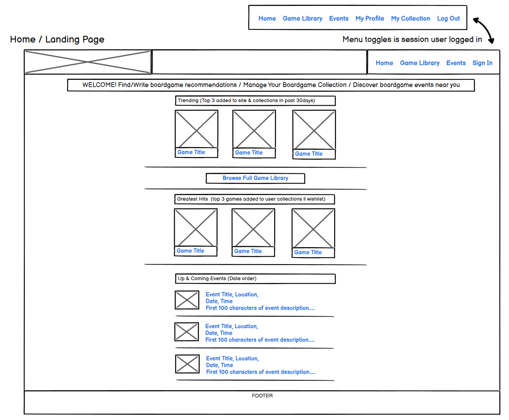

Early development Index page wireframe mobile

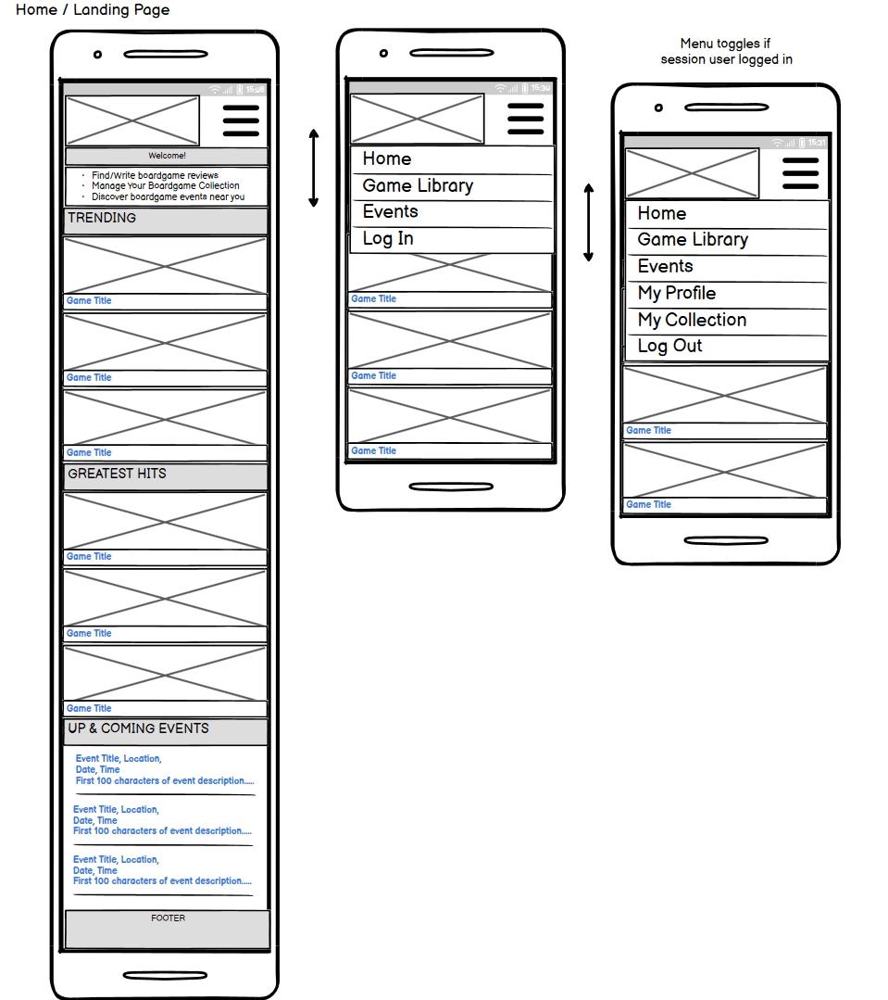

Early development Library page wireframe desktop

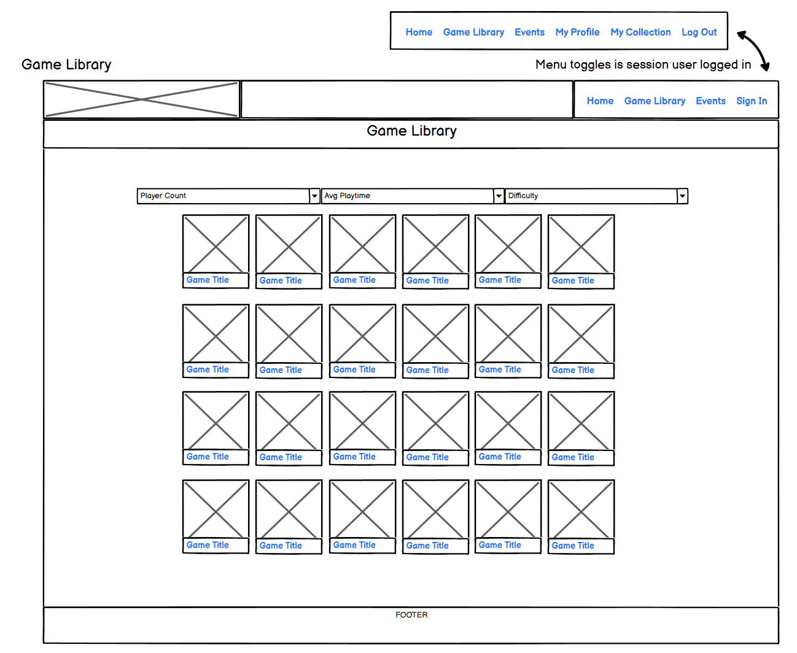

Early development Library page wireframe mobile

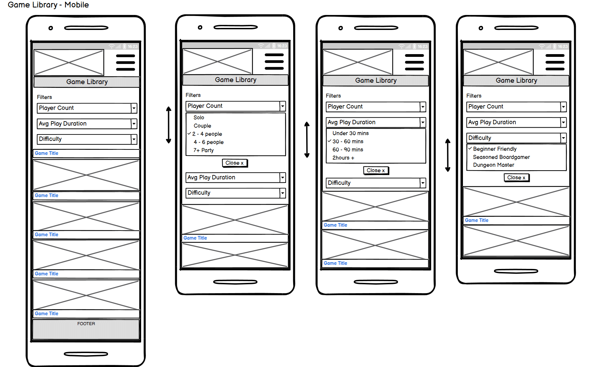

Early development Profile page wireframe desktop

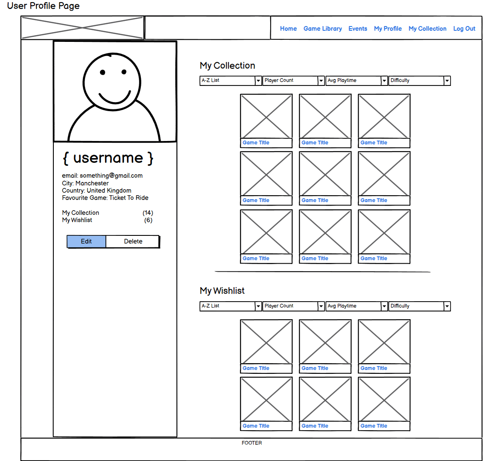

Early development Profile page wireframe mobile

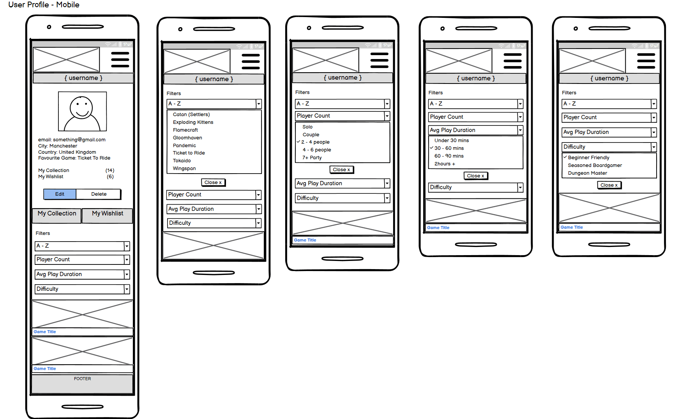

 
This planning and development work is uploaded to Figma. The design page on Figma is a useful tool to layout all my early project documents in one space, and share online with others for additional input. It allowed my mentor to quickly view and understand my project themes and objectives. 

Using Figma's wireframes capabilities, I was able to play with initial layouts and plan intuitive flow around my site. This has given me a good understanding of how an MVP might be presented to me by a frontend designer.

### Colour Scheme

To hit site objective 10, I've chosen a bright, 80's-style colour-scheme. The contrasts provide good readability and accessibility. The colour choices appeals to all genders and ages. Some bootstrap button colours have also been included, and these compliment my base colour scheme well.

### Typography
'Syne" from Google Fonts was selected throughout as a clear, easily-readable font choice that matches my site asthetic. [View here](https://fonts.google.com/?query=syne)

A generic Arial, Helvetica, & sans-serif fonts have been included as a backup in the event 'Syne' fails to load or is incompatible with the user's browser. 

[**Back to top**](#boardgame-buddy)
## Features

This project includes many features, these include:

### Fully Responsive 
- This site adapts to all devices and screen sizes ranging between 320px to 2560px wide (Tested).
- Responsive break points tested on screen widths: 320px / 576px / 768px / 992px / 1200px / 1400px / 2560px. 

### Intuitive Navigation
- The navigation bar remains at the top of the screen with navigation links to the right. In keeping with typical user expectations.
- All pages can be accessed within 1-3 user clicks. 
- Often there are multiple ways for the user to navigate to the same pages.
  - Examples: 
    - Library page: users can access a game's full info page by clicking on the card Game Image, the Game Title, or the More Info button.
    - User Collection area: as well as being able to click the "Remove" button on a game image, users can click the main image and navigate to it's full info page. 
    - Where actions require a user to have an account and be logged in, if no sesssion user is found, a notification paragraph shows explaining this. If the user still clicks the Call-To-Action, the button navigates them to the Log in page instead. 

### Clear typography
- The highly legible and readable font 'Syne' was selected from Google-fonts. As a Google-fonts listed typography, 'Syne' has a high chance of being usable across most devices. A generic fonts have been coded to display in the event a device is not compatible with 'Syne'. 

### Custom Logo
- Custom designed Logo in keeping with project brand aesthetics: both in colour and typography.
- SVG format for optimum resolution quality at all screen sizes.
- With thanks to Shaun Russell for the logo design.

### Images
- Images feature frequently across the site as a part of game info and user profile options. 
- Images are stored in the mongoDB as URL's and can be rendered very quickly for positive UI and UX.

### Search filters functionality
- Users can filter the library to views only the games that meet their gaming needs. 
- Searches are instantaneous and the library is already populated with a good selection of games. 

### High performance / fast loading times. 
- MongoDB excels at fetching large quantities of data, so as the site grows (with users collectively adding hundreds of games), site performance should be maintained.

### User profile creation and editing
- Users are allowed to create and edit their own profile account. 

### User games contribution
- With an active account, users are allowed to add additional games to the site library.
- These are then available to all users, to browse info, review, and add to their own collections. 

### User personal collection creation and management
- Users can add and delete games in their own personal collection.

### Large Font and Buttons
- With the exception of some form/button help text, all main site text remains a minimum of 1rem (16pt) font size for readability and accessibility. 
- All buttons maintain a minimum size of 48px x 48px. These are the WCAG 2.1 recommended guidelines for touchscreen buttons.
- Large buttons also improves accessibility for people with physical disabilities who have dexterity needs.

### Theme appropriate colour scheme
- Colour scheme is chosen with a retro 80's feel, so appeal to the site's most typical users. 
- Eye comfort. There is no black on white (or visa versa). The dark purple has been chosen to soften screen glare of high contrast combinations. This is with all user's comfort in mind, but also for those with high visual needs.  

### High Standards of Accessibility 
[According to accessguide.io](https://www.accessguide.io/)

- Definite status messages - 404 page included.
- Responsive design.
- High colour contrast.
- No colours convey information - colour blind users
- No flashing lights. Care has been taken to select gifs with minimum to no flashing lights.
- No background audio or autoplay audio.
- Aria-labels on all interactive elements.
- Alt descriptions on all images.
- Semantic elements to assist screen reader users to navigate and access information.
- Consistent navigation.
- Minimum font size of 16px throughout the site and on all screen sizes.  

### Family Friendly
- This site is free from offensive language and imagery, and is suitable for users of all ages. As content can be created by users, frequent maintenance would be needed to preserve this. An additional contact form could be added so users can notify admins of any offensive material added. T&Cs added to add game form.  

### The Footer
The footer provides copyright information and name of the site creator. Plus clickable links to my github and linkedin pages. 

[**Back to top**](#boardgame-buddy)
## Future Features
### Feedback Form
A feedback form page. User can report misuse of content creation. Users can be invited to report bugs, ask for future features, or suggest accessibility improvements.  

### Advertising 
An advertising banner could be added to promote company sponsors.
Monitised links to boardgame online shops to direct users to purchase could be included on the game full info page. 
- User feedback from Penny Lewis: "You could have links that take you to independents that sell the games, rather than Amazon."

## Future Features Requested my user testers

### Joe Hewitt
"Two possible features i would like to see added to my collection page. A way to track/add plays of the games. I would find it interesting to see which games i have played most. A date field could also be added to this but i feel it's not of paramount importance. Secondly, a simple personal comments box for each game. It would be handy to add notes like 'My friend Bob didn't enjoy this game'or 'On the lookout for future expansions!'."

### Tom Harris
"If I was to suggest improvements, I would say the following: 
- Add a star rating to your review system
- Change the colour of the footer to yellow so it matches the layout of your header (Done)
- Remove the "Title:" from the game header (Done)
- Display users avatars in the review section
- Remove the animation from the nav bar when its pushed into the burger menu (when scales on a laptop, it can make it hard to click)
- Potentially look at how the text is displayed on the game description/information."

[**Back to top**](#boardgame-buddy)
## Testing
- Please see full documentation for testing and bug reports [here](TESTING.md)

## Deployment
[Click here to deploy this project live](https://boardgame-buddy-c89ff5d28931.herokuapp.com/)

### **Languages**
- HTML
- CSS
- Javascript
- Python

### **Frameworks and Tools**
- Git
- GitHub
- Bootstrap 4.6
- JQuery
- Flask
- Visual Studio Code
- Font Awesome
- Figma
- Favicon.io
- Tinypng.com
- Lighthouse
- W3C Markup validation service
- W3C Jigsaw CSS validation service
- WAVE WebAIM web accessibility evaluation tool

### **Software**
- MongoDB - Data storage and management
- Heroku - Deployment
- Visual Studio Code to create, load and push my code to Github.
- Git and Github as my version control system for the site.
- Figma to create design-boards, wireframes and prototypes.
- Procreate to create design pages and sketch-work, images and logo.

[**Back to top**](#boardgame-buddy)
## **Imported Code**
Template code blocks taken from [Bootstrap 4.6 Library](https://getbootstrap.com/docs/4.6/components/navbar/). Heavily modified to suit my project requirements.

View the navbar code here

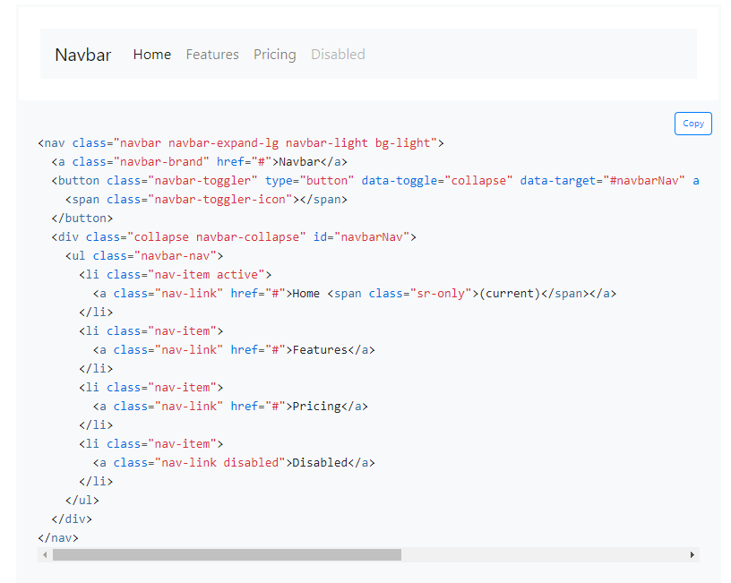

View the card panel code here

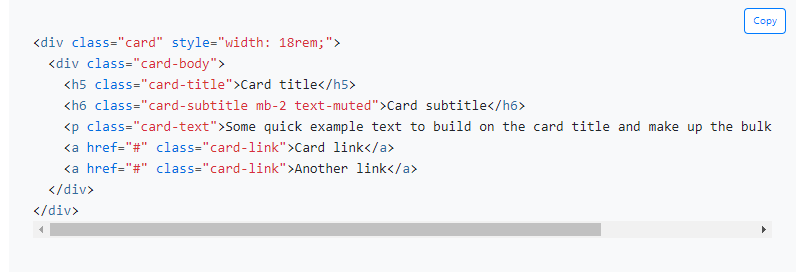

View the navbar forms code here

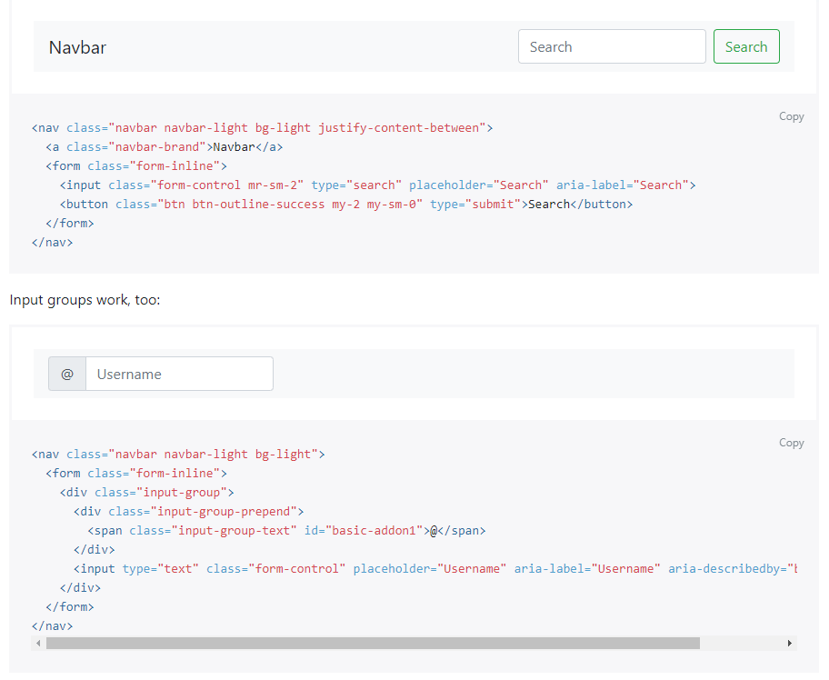

 
Onerror image attribute to handle image errors - Taken from an article by Rahul Nanwani.

View the code here

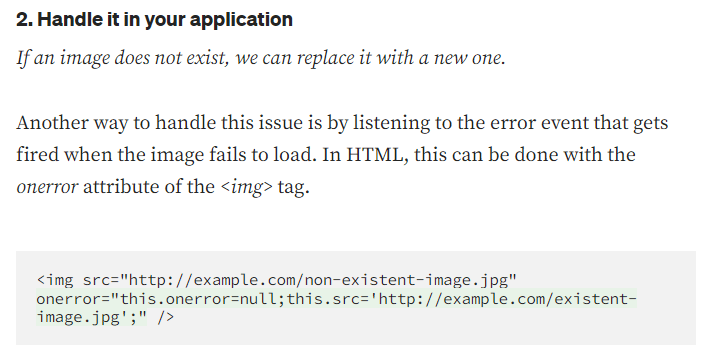

## **Tutorials** ##

- Create a 404 page in flask|python tutorial video by ZetBit
[View here](https://www.google.com/search?q=flask+how+to+add+404+pages&rlz=1C1GCEU_enGB1105GB1105&oq=flask+how+to+add+404+pages&gs_lcrp=EgZjaHJvbWUyBggAEEUYOTIICAEQABgWGB4yCAgCEAAYFhgeMggIAxAAGBYYHjIICAQQABgWGB4yCAgFEAAYFhgeMgoIBhAAGIAEGKIEMgoIBxAAGIAEGKIEMgoICBAAGKIEGIkFMgoICRAAGIAEGKIE0gEINzgxMmowajeoAgCwAgA&sourceid=chrome&ie=UTF-8#fpstate=ive&vld=cid:7525ba34,vid:50N7K4oDF4g,st:43)

- Handling image doesn't exist issues. Article by Rahul Nanwani [View here](https://blog.imagekit.io/how-to-handle-loading-images-that-may-not-exist-on-your-website-92e6c3c6ea63)

## **Credits**
- Shaun Russell: site logo.
- Google Fonts for 'Syne" typography [View here](https://fonts.google.com/specimen/Syne)
- Favicon.io for icon converter & instructions [View here](https://favicon.io/)
- Tinypng.com for image compression [View here](https://tinypng.com/)
- Accessguide.io an excellent accessibility guide [View here](https://www.accessguide.io/)

## Site Testers
- Shaun Russell - Senior UI/UX designer
- Tom Harris - User tester
- Joe Hewitt - User tester
- Dean Russell - User tester
- Penny Lewis - User tester

## **Thanks**
- Richard Wells: Senior Developer, site tester, and my Code Institute Mentor.

- atapas: for his markdown-cheatsheet [View here](https://github.com/atapas/markdown-cheatsheet#horizontal-line)

- Tom Harris: Site tester, and my biggest cheerleader.

- Shaun Russell: Senior UX/UI/Product Designer. My site tester, my partner, and my provider while I study. Building my new development career change would have been infinitely harder without you. Thank you.

[**Back to top**](#boardgame-buddy)