# Testing Boardgame Buddy
This project was tested continuously during development. Post build, the site has been manually tested by myself and third party testers. It has also passed on html, CSS, JS, and accessibility validators. 

[return to README.md](README.md)

**PLEASE NOTE: This documentation contains many images which can be viewed via a dropdown toggle.**
## Table of Contents
* [**During Development Testing**](#during-development-testing)
    * [*Manual Testing*](#manual-testing)
    * [*Bugs and Fixes*](#bugs-and-fixes)
* [**Post Development Testing**](#post-development-testing)
  * [**Post Development Testing Expanded**](#post-development-testing-expanded)
    * [Home Page Manual Testing](#home-page-manual-testing)
  * [**User Story Testing**](#user-story-testing)
  * [**Validators**](#validators)
      * [*HTML*](#html---httpsvalidatorw3orgnu)
      * [*CSS*](#css---httpsjigsaww3orgcss-validator)
      * [*JavaScript*](#javascript---httpsjshint.com)
  * [**Lighthouse Scores**](#lighthouse-scores)
  * [**Accessibility**](#accessibility)
* [**Third Party Testing**](#third-party-testing)
*  [**Third Party Feedback**](#third-party-feedback)
* [**With Thanks**](#thank-you-to-my-product-testers)

## **During Development Testing**
During the development process, I was manually testing in the following ways:-

1. Manually tested each element for appearance and responsiveness via a simulated live server by running app.py in PORT 5000.

2. 
    
3. 

## Manual Testing:

### Browser Compatibility
During testing, I used four different browsers to ensure cross-compatibility. The desktop browsers used by myself were:

  1. Chrome
  2. Firefox  
  3. Edge

Shaun Russell - Site tester - Tested on Chrome, Firefox, and Edge.
Tom Harris - Site tester - Tested the project on Safari.

### Screen Sizes

The site has been tested at screen sizes 320px to ###px in width.

Screen Size: 320px

Screen Size: ###px

### Function Testing

Function Testing Image

 
The functions are all tested via their output displayed in the UI, the console, or both. (All console.log and console.info have been removed in the final version of the project).

[**Back to top**](#testing-boardgame-buddy)
## ***Bugs and Fixes:***

Below is a list of bugs I found during the development process by testing myself :-

1. **Deployment Issue** - 
    * ***Issue Found:*** 
        * Initial build and deployment to Heroku failed.
        * Error message: "Push failed: cannot parse Procfile"
            

Click here to view the error image

            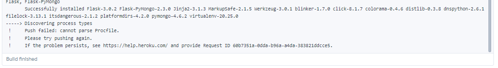
            

    * ***Solution Used:*** 
        
2. **Logo not displaying** 
    * ***Issue Found:***
        * Custom svg logo wouldn't display. 
        * My code inside the anchor tag = {{ url_for('static', filename='bgb-logo.svg') }}
            

Click here to view the logo bug

            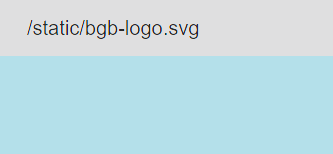
            

    * ***Solution Used:***    
        * Tried Flask documentation without success. 
        * Found the answer on stack overflow [here.](https://stackoverflow.com/questions/28207761/where-does-flask-look-for-image-files#:~:text=Ideally%20your%20web%20server%20is,at%20%2Fstatic%20on%20the%20application.&text=The%20file%20has%20to%20be,the%20filesystem%20as%20static%2Fstyle.)
            

Click here to view solution

            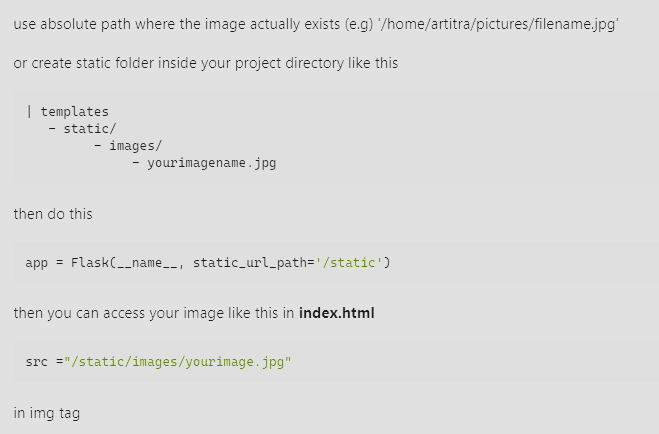
            

3. **Undefined Error 01** 
    * ***Issue Found:*** 
        * User Profile page would not load/display
            

Click here to view original code function

            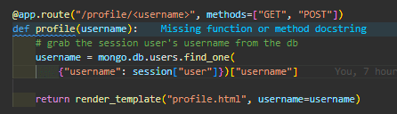
            

            

Click here to view the error message

            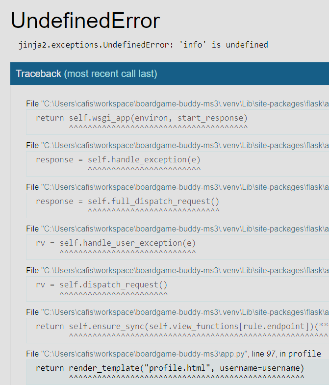
            

    * ***Solution Used:***    
        * Created an info variable inside the function.
        * Passed that to the page inside the render_template returned
            

Click here to view the code fix

            
            

4. ***Undefined Error 02** 
    * ***Issue Found:*** 
        * User Profile page would not load/display
            

Click here to view the error message

            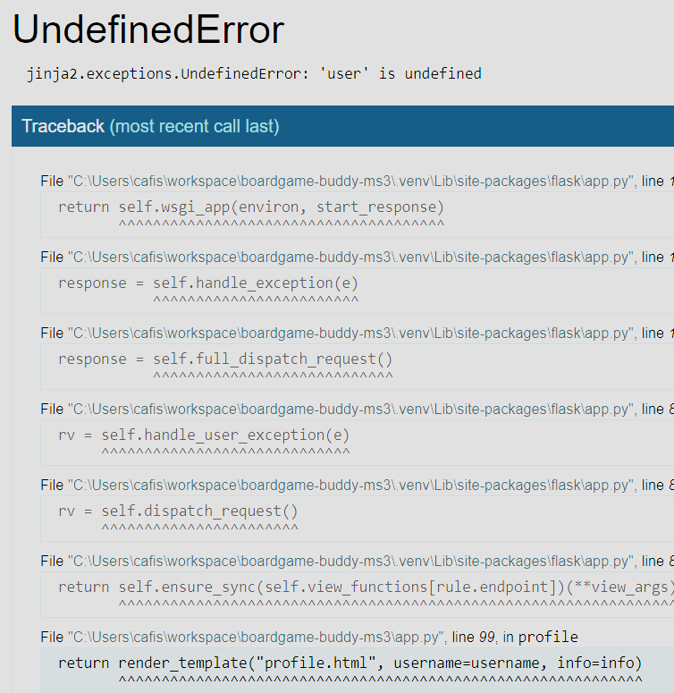
            

    * ***Solution Used:***    
        * Passed the page user=username from inside the function, instead of from the argument passed into the function.
            

Click here to view the error message

            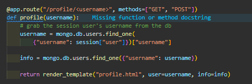
            

5. **NULL entry for review_title in mongoDB** 
    * ***Issue Found:*** 
        * During a review creation: I discovered the review form was failing to pass data to the review_title key:value in the mongoDB.
        * Resulting in a "null" entry
            

Click here to view the mongoDB result

            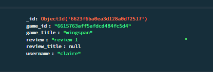
            

    * ***Solution Used:***    
        * Found a typo on the name attribute in the review-title input.
            

Click here to view the typo (line 52)

            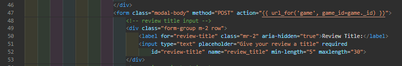
            

        * Corrected name="review_title" to name="review-title"
            

Click here to view the db creating a new entry correctly 

            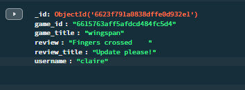
            

6. **Relevant reviews not displaying** 
    * ***Issue Found:*** 
        * Review data not displaying as expected.
            

Click here to view the reviews bug

            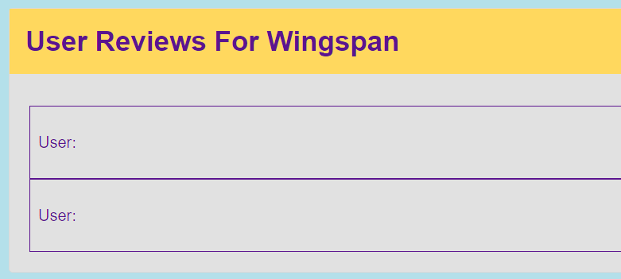
            

            

Click here to view the html with for loop

            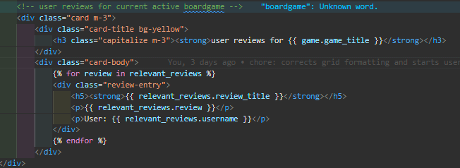
            

    * ***Solution Used:***    
        * Corrected the targeting syntax in jinja code in the html.
            

Click here to view the fix

            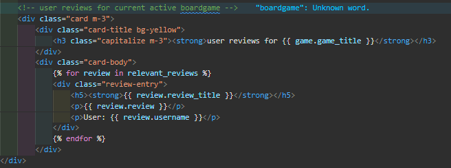
            

7. **Attribute error - collection creation** 
    * ***Issue Found:*** 
        * Expected when "Add to Collection" button clicked: function would check the db for an existing collection for that user, and if none found, create a new object and add the selected games id to an empty array.
        * Attribute error message thrown. Db entry not created. 
            

Click here to view the error message

            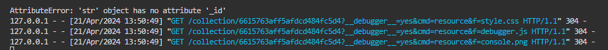
            

            

Click here to view the function code

            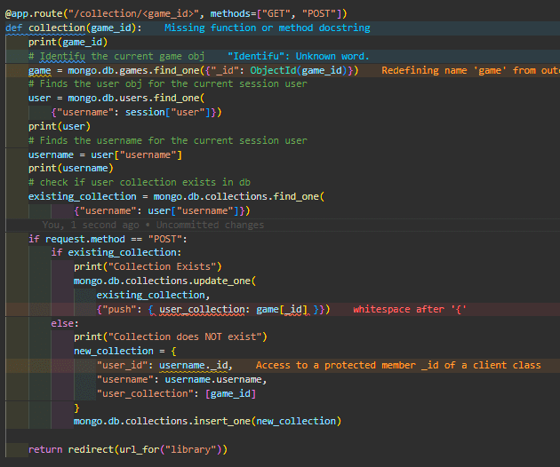
            

    * ***Solution Used:***    
        * Corrected the syntax error to target the id correctly.
        * Db entry creation also working.
            

Click here to view the corrected code

            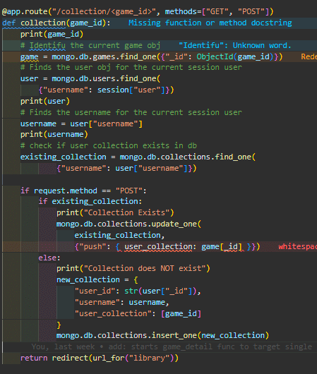
            

            

Click here to view the db entry creation

            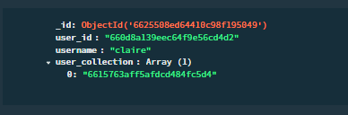
            

8. **Non-Type Error: No user_collection for current user** 
    * ***Issue Found:*** 
        * If user has no existing collection db doc: their profile page wont render and throws the following error.
            

Click here to view error message

            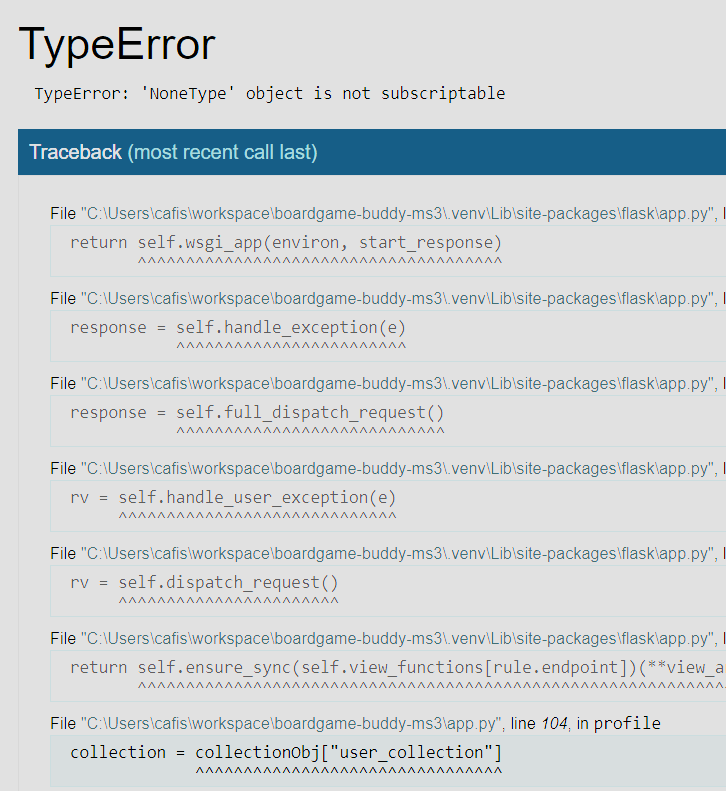
            

    * ***Solution Used:***    
        * As part of the user registration function, I call a second "new_collection" function.
        * (The register function has to complete first so the user doc is added to mongoDB and therefore a unique _id generated)
        * The new_collection function generates and "empty" collection and links it to the user with the correct matching data.
        * Profile page now renders as expected: with an empty collection section. 
            

Click here to view the code fix

            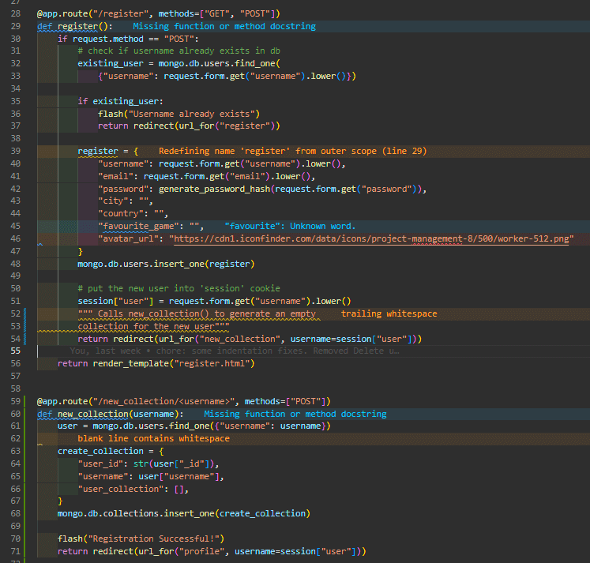
            

9. **ISSUE NAME** 
    * ***Issue Found:*** 
        * ...
    * ***Solution Used:***    
        * ...

[**Back to top**](#testing-boardgame-buddy)  
## **Post Development Testing**

Post development, I manually tested in the following ways:-

1. Manually tested each element for appearance and responsiveness via a simulated live server.

2. The code passed through HTML, CSS, JavaScript(ES6) validators to check for errors.
* [**Validators Results**](#validators)
3. The code passed through an Accessibility evaluation. 
*  [**Accessibility Results**](#accessibility)
4. Published the page via GitHub pages and shared with fellow students to test and receive feedback.

5. Sent my gitHub to link to three third party testers with different devices, browsers, and skill sets:
    - Dan Sanderson - Senior Developer
    - Shaun Russell - Senior UI/UX/Product Designer
    - Tom Harris - Enterprise Account Manager, krystal.io and Safari user 

## **Post Development Testing Expanded**

My manual testing logs are as follows:
***
### Home Page Manual Testing
***
**Home Page Test 1 -  Incorrect URL (random letter character)**
* Expected:
  * Site expected to display 404-page when the user enters an incorrect URL.
* Testing:
  * Tested site by adding a random letter at the end of URL
* Result:
  * The site acted as expected and showed its custom 404-page.
* Action: 
  * None
***
**Home Page Test 2 -  Incorrect URL (random number character)**
* Expected:
  * 
* Testing:
  * 
* Result:
  * 
* Action: 
  * 
***

[**Back to top**](#testing-boardgame-buddy)

## **User Story Testing**
1. **As a user, I want to be entertained.**
  * The site provides:
    * Entertainment in the form of a game play. 
    * User interactive elements.
    * Fast feedback to user interactions. 
    * Countdown to build suspense.
    * Rewarding Game-Over feedback with animated gifs.
    * Availability on mobile device to play anywhere, and anytime.  

[**Back to top**](#testing-boardgame-buddy)
## **Validators**

### HTML - https://...

HTML validator Results Image

 

* ***Errors Found:***
    * None
* ***Warnings Found:***
    * 
* ***Action Taken:***
    * None

### CSS - https://...

CSS validator Results Image

 

* ***Errors Found:***
    * None
* ***Action Taken:***
    * N/A

### JavaScript - https://jshint...

JS validator Results Image

 

JSHint validator was configured to recognise New JavaScript Features (ES6), and jQuery.
* ***Errors Found:***
    * None
* ***Action Taken:***
    * N/A

## Lighthouse Scores
### Test conditions
* All lighthouse tests were run in incognito mode to avoid interference from browser extensions. 
* Both mobile and desktop performance are tested. 

Desktop Results

 

Mobile Results

 
 

## **Accessibility** 
In addition to the accessibility score on lighthouse, [WAVE - Web accessibility evaluation tool](https://wave.webaim.org/) has been used to check the site for accessibility issues. 

Wave Accessibility Evaluation Results Image

 

* ***Errors Found:***
    * None
* ***Contrast Errors Found:***
    * None
* ***Alerts Found:***
    * 
* ***Action Taken:***
    * None.
    * Reason: 

[**Back to top**](#testing-boardgame-buddy) 
### **Third Party Testing**

1. **Final result "Draw"**
    * ***Tester feedback: Shaun Russell***
        * The "Final Result: Draw" outcome is confusing to the user. 
        * Suggestion: Have "Win" and "Lose" game completion options only.
        * Draw will continuously tally until Win or Lose scores reach three.
2. **TEST NAME**
    * ***Tester...***
        *
### Third Party Feedback
1. <u>** ###EXAMPLE DO NOT LEAVE THIS IN###Dan Sanderson - Senior Developer.**</u>
  * "It looks great to me. Plays well and reliably. Nice job!".
 
  * "Some UI feedback, but it's minor, it's a bit difficult to know who's won each turn until you look closely and read the text. It's not in-your-face, but maybe that's what you're going for... One way around this might be to change the background colour of the results box to red or green if you lose or win, but I know your palette is monotone, so not sure how that would work".

  * "A future feature you could add would be to take all the hardcoded text out of your JS and HTML files and stick that in a language file. Then you can just run it through google translate or something and then have an English and maybe a French option etc which you can swap with a button."

## Thank you to my product testers
- Richard Wells: Senior Developer, and my Code Institute Mentor.

- Dan Sanderson: Senior Developer.

- Shaun Russell: Senior UI/UX/Product Designer. 

- Tom Harris: Site tester, Safari user.

- Various friends and family members.

[**Back to top**](#testing-boardgame-buddy)

[return to README.md](README.md)