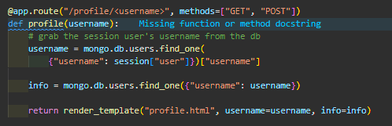
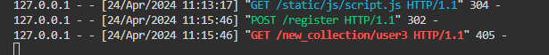

# Testing Boardgame Buddy
This project was tested continuously during development. Post build, the site has been manually tested by myself and third party testers. It has also passed on html, CSS, JS, and accessibility validators. 

[return to README.md](README.md)

**PLEASE NOTE: This documentation contains many images which can be viewed via a dropdown toggle.**
## Table of Contents
* [**During Development Testing**](#during-development-testing)
    * [*Manual Testing*](#manual-testing)
    * [*Bugs and Fixes*](#bugs-and-fixes)
* [**Post Development Testing**](#post-development-testing)
  * [**Post Development Testing Expanded**](#post-development-testing-expanded)
    * [Home Page Manual Testing](#home-page-manual-testing)
  * [**User Story Testing**](#user-story-testing)
  * [**Validators**](#validators)
      * [*HTML*](#html---httpsvalidatorw3orgnu)
      * [*CSS*](#css---httpsjigsaww3orgcss-validator)
      * [*JavaScript*](#javascript---httpsjshint.com)
  * [**Lighthouse Scores**](#lighthouse-scores)
  * [**Accessibility**](#accessibility)
* [**Third Party Testing**](#third-party-testing)
*  [**Third Party Feedback**](#third-party-feedback)
* [**With Thanks**](#thank-you-to-my-product-testers)

## **During Development Testing**
During the development process, I was manually testing in the following ways:-

1. Manually tested each element for appearance and responsiveness via a simulated live server by running app.py in PORT 5000.

2. Checked functionality as I built. Dealing with bugs and error messages during development. (See bugs and fixes)
    
3. Sought feedback from my mentor and student peers at key intervals during development. 

## Manual Testing:

### Browser Compatibility
During testing, I used four different browsers to ensure cross-compatibility. The desktop browsers used by myself were:

  1. Chrome
  2. Firefox  
  3. Edge

I have manually tested on Chrome.
Shaun Russell - Site tester - Tested on Firefox, and Edge.
Tom Harris - Site tester - Tested the project on Safari.

### Screen Sizes

The site has been tested at screen sizes 320px to 2560px in width.

Screen Size: 320px

Screen Size: 2560px

### Function Testing
The functions are all tested via their output displayed in the terminal with print statements, the browser display, or both. (All print statements have been removed in the final version of the project).

[**Back to top**](#testing-boardgame-buddy)
## ***Bugs and Fixes:***

Below is a list of bugs I found during the development process by testing myself :-

1. **Deployment Issue** - 
    * ***Issue Found:*** 
        * Initial build and deployment to Heroku failed.
        * Error message: "Push failed: cannot parse Procfile"
            

Click here to view the error image

            
            

    * ***Solution Used:*** 
        
2. **Logo not displaying** 
    * ***Issue Found:***
        * Custom svg logo wouldn't display. 
        * My code inside the anchor tag = {{ url_for('static', filename='bgb-logo.svg') }}
            

Click here to view the logo bug

            
            

    * ***Solution Used:***    
        * Tried Flask documentation without success. 
        * Found the answer on stack overflow [here.](https://stackoverflow.com/questions/28207761/where-does-flask-look-for-image-files#:~:text=Ideally%20your%20web%20server%20is,at%20%2Fstatic%20on%20the%20application.&text=The%20file%20has%20to%20be,the%20filesystem%20as%20static%2Fstyle.)
            

Click here to view solution

            
            

3. **Undefined Error 01** 
    * ***Issue Found:*** 
        * User Profile page would not load/display
            

Click here to view original code function

            
            

            

Click here to view the error message

            
            

    * ***Solution Used:***    
        * Created an info variable inside the function.
        * Passed that to the page inside the render_template returned
            

Click here to view the code fix

            
            

4. ***Undefined Error 02** 
    * ***Issue Found:*** 
        * User Profile page would not load/display
            

Click here to view the error message

            
            

    * ***Solution Used:***    
        * Passed the page user=username from inside the function, instead of from the argument passed into the function.
            

Click here to view the error message

            
            

5. **NULL entry for review_title in mongoDB** 
    * ***Issue Found:*** 
        * During a review creation: I discovered the review form was failing to pass data to the review_title key:value in the mongoDB.
        * Resulting in a "null" entry
            

Click here to view the mongoDB result

            
            

    * ***Solution Used:***    
        * Found a typo on the name attribute in the review-title input.
            

Click here to view the typo (line 52)

            
            

        * Corrected name="review_title" to name="review-title"
            

Click here to view the db creating a new entry correctly 

            
            

6. **Relevant reviews not displaying** 
    * ***Issue Found:*** 
        * Review data not displaying as expected.
            

Click here to view the reviews bug

            
            

            

Click here to view the html with for loop

            
            

    * ***Solution Used:***    
        * Corrected the targeting syntax in jinja code in the html.
            

Click here to view the fix

            
            

7. **Attribute error - collection creation** 
    * ***Issue Found:*** 
        * Expected when "Add to Collection" button clicked: function would check the db for an existing collection for that user, and if none found, create a new object and add the selected games id to an empty array.
        * Attribute error message thrown. Db entry not created. 
            

Click here to view the error message

            
            

            

Click here to view the function code

            
            

    * ***Solution Used:***    
        * Corrected the syntax error to target the id correctly.
        * Db entry creation also working.
            

Click here to view the corrected code

            
            

            

Click here to view the db entry creation

            
            

8. **Non-Type Error: No user_collection for current user** 
    * ***Issue Found:*** 
        * If user has no existing collection db doc: their profile page wont render and throws the following error.
            

Click here to view error message

            
            

    * ***Solution Used:***    
        * As part of the user registration function, I call a second "new_collection" function.
        * (The register function has to complete first so the user doc is added to mongoDB and therefore a unique _id generated)
        * The new_collection function generates and "empty" collection and links it to the user with the correct matching data.
        * Profile page now renders as expected: with an empty collection section. 
            

Click here to view the code fix

            
            

9. **Key Error 'user'** 
    * ***Issue Found:*** 
        * Game full info page would not load if no user is logged in.
            

Click here to view the error message

            
            

            

Click here to view the code

            
            

    * ***Solution Used:***    
        * Set a username variable to equal None
        * Set an if statement checking to see if a user is logged in.
        * Moved the If method "POST" inside the check for user statement, as only users can add reviews. 
        * Created an If statement in game.html to redirect the user to log in, if they still try to click the buttons.
            

Click here to view the fix

            
            

10. **Error 405 - User registration** 
    * ***Issue Found:*** 
        * Browser throws a 405 error after user registers.
            

Click here to view the browser error msg

            
            

            

Click here to view the terminal error msg

            
            

    * ***Solution Used:***    
        * Called the new_collection func inside the register function. 
        * Redirected the user to the games library instead of their profile page. This allows the backend to build the profile data and collection data for the new user, before trying to render that info. 
            

Click here to view the fix

            
            

11. **Difficulty serach not working** 
    * ***Issue Found:*** 
        * Difficulty dropdown search not filtering games in library
            

Click here to view the code

            
            

    * ***Solution Used:***    
        * Fixed request code from .args to .form.get()
            

Click here to view the fix in app.py

            
            

        * Gave the html a starting dropdown with an empty value & an inner text of Options
            

Click here to view the fix in library.html

            
            

        * Created an event listener in JS to auto submit the search form if the user makes a changes to the dropdown
            

Click here to view the fix in script.js

            
            

12. **Unbound local Error 304** 
    * ***Search button clicked when no data input:*** 
        * If the user clicks the search button without entering any search info, 304 message thrown. Unbound local error.
            

Click here to view the error message

            
            

            

Click here to view the code

            
            

    * ***Solution Used:***    
        * Created an if statement at the end of the function, to check if no data in variable query. 
        * If no data found, flash messages the user "You didn't enter any search fields", and refreshes the library with a reutnr redirect
            

Click here to view the code

            
            

[**Back to top**](#testing-boardgame-buddy)  
## **Post Development Testing**

Post development, I manually tested in the following ways:-

1. Manually tested each element for appearance and responsiveness via a simulated live server.

2. The code passed through HTML, CSS, JavaScript(ES6), pep8 validators to check for errors.
* [**Validators Results**](#validators)
3. The code passed through an Accessibility evaluation. 
*  [**Accessibility Results**](#accessibility)
4. Published the page via GitHub pages and shared with fellow students and friends (particularly boardgame fans) to test and receive feedback.

5. Sent my deployed project to multiple user testers with different devices, browsers, and skill sets.
    - Jump to: [**Third Party Testing**](#third-party-testing) here

## **Post Development Testing Expanded**

My manual testing logs are as follows:
***
### Home Page Manual Testing
***
**Incorrect URL**
* Expected:
  * Site expected to display 404-page when the user enters an incorrect URL.
* Testing:
  * Tested site by adding a random at the end of URL
* Result:
  * The site acted as expected in some cases and showed the 404-page. But not reliable. 
* Action: 
  * Included try: except: conditions to the error handler function to catch all page errors.  
***
**Incorrect URL (SECURITY BREACH)**
* Expected:
  * Expected site to show 404 when a user tries to access other user's profile information or user-only features (such as add_game) by manually manipulating the url.
* Testing:
  * Tried to access unauthorised pages and sections without logging in or by typing "other" usernames into the url. 
* Result:
  * The site allowed unauthorised access to /profile/*username*, /edit_profile/*username*, and /add_game 
* Action: 
  * Added if conditions to the pages that direct to those pages, checking if a session user is True, and checking the session user matches the username given in the url.
  * Page no longer gives unauthorised access to those areas.
***
**Navigation links in top navbar**
* Expected:
  * Expected the nav bar links to redirect to the correct pages and render the correct information.
* Testing:
  * Clicked Logo / Games Library / Register / Log in / Profile / Add Game / Log Out in turn
* Result:
  * All pages redirected correctly and with the correct data fetched and displayed
* Action: 
  * None
***
**Search bar - No data**
* Expected:
  * If no search data entered and search button clicked.
* Testing:
  * Expected full library to keep displaying and a flash message to tell the user they didn't search for anything.
* Result:
  * Library displays and flash message "You didn't enter any search fields"
* Action: 
  * None
***
**Search bar - player count outside range**
* Expected:
  * A validation pop up if the user enters a number outside the give range 1-8. Library should show full game list.
* Testing:
  * Entered a search of 0, and a search of 9, 10, 20. 
* Result:
  * Validation pop up shows reminding user of the acceptable range values. Library unchanged. 
* Action: 
  * None
***
**Search bar - player count inside range**
* Expected:
  * Games library to filter according to the numbers of players entered by the user.
* Testing:
  * Searched through all numbers from 1-8.
* Result:
  * Game library behaved as expected and filtered the games correctly. 
* Action: 
  * None
***
**Search bar - avg playtime outside range**
* Expected:
  * Values <15 to pop up a validation message. Values >121 to do the same.
* Testing:
  * Tested values 0, 1, 2, 121, 300
* Result:
  * Values <15 redirected to "Oops, no games found" which is acceptable.
  * Values >121 showed the full library. This is also acceptable. If a party game lasts longer than 2hours, board gamers will usually split sessions into multiple play sessions. 
* Action: 
  * None
***
**Search bar - avg playtime inside range**
* Expected:
  * Games library to filter all games below and including value set. 
* Testing:
  * Values 15, 20, 30, 45, 120 entered
* Result:
  * Games filtered correctly
* Action: 
  * None
***
**Search bar - Difficulty dropdown**
* Expected:
  * Games to filter according to difficulty rating searched.
* Testing:
  * Selected Beginner, then clicked Search
  * Selected Advanced, then clicked Search
* Result:
  * Games filters and displayed as expected
* Action: 
  * None
***
**Search bar - Title search**
* Expected:
  * The search bar to find the title entered into the search bar
* Testing:
  * Searched for the following:
    - Catan
    - catan
    - CATAN
    - cat
    - catttan
    - ticket
    - ticket to
    - ticket to ride
    - tick
* Result:
  * Searched found and displayed the correct game regardless of casing. 
  * Multiple word searches also worked correctly. 
  * Partial words and misspellings displayed the "Oops, no games matching your search found". This is acceptable. For future features, I would like to add suggestions ("Did you mean "Catan"?), or a dropdown updating dynamically as the user types, to offer suggestions of already existing games. 
* Action: 
  * None
***
**Search bar - Reset**
* Expected:
  * Fetch all games in the db
* Testing:
  * Filtered the games library with the searches - clicked Reset
* Result:
  * Game library refreshed back to the full db library of games
* Action: 
  * None
***
**Game Card Navigation - Game Info**
* Expected:
  * The site to fetch and display the full info page for the game targeted.
  * This function should be achieved by clicking any of the following card features: Game Image / Game Title / More Info
* Testing:
  * Clicked the Game Image / Game Title / More Info Button on the following game cards:
    - Ticket to ride
    - Wingspan
    - Splendor
* Result:
  * Each link worked as expected. Fetching and rendering the info page for the correct target game. 
* Action: 
  * None
***
**Game Card Navigation - Add to Collection**
* Expected:
  * If user logged in: clicking add to collection on a game card will do one of two things:
    - If game already in user collection - flash message to tell the user. 
    - If game not in user collection - flash message to tell the user and game image will now appear in the collection section of their profile page.
  * If no user logged in:
    - "You must be logged in message to add this game" below the "Add to Collection" button.
    - If button still clicked: redirected to Log in page
* Testing:
  * As an session user:
    - 1a. Clicked the Add to Collection btn on a game card.
    - 1b. Clicked to Add a game I knew already existed in the user's collection.
  * When logged out / no session user:
    - 2a. Clicked the Add to Collection btn on a game card. 
* Result:
  - 1a. No response, but the game did appear in the users collection when checking the profile page.
  - 1b. Behaved as expected. Flash message and user collection unchanged.
  - 2a. Behaved as expected. Message below the button. Redirected to log in page if user still clicks. 
* Action: 
  * 1a. Flash message added to collection() in app.py. User now notified that their Game added successfully.
***
**Game Page - no reviews**
* Expected:
  * If no reivews in db for target game. Show the "no revies message" in the game info page
  * If no reviews: reviews number should equal 0.
  * If there's an active session user: button to leave a review
  * If there's no session user: button to Log In
* Testing:
  * Navigated to a game with no reviews.
* Result:
  * No reviews message displaying as expected. 
  * Reviews number displaying 0 as expected. 
  * If active user: Leave a review button there, but doesn't work on click. 
  * If no active user: Log in button there, and working as expected.
* Action: 
  * Removed the "Leave a review" button from the "no reviews" message section. (There is already a review button in the game main info section above.)
***
**Game Page - Buttons**
* Expected:
  * 1: "Back to main game library" button clicked - site rendered library page with all games displayed.
  * 2a: If no user message under "Leave a review" button to tell the user they need to log in. Direct to log in page if still clicked.
  * 2b: If active user: "Leave a review" button opens the write review modal.
* Testing:
  * 1: Clicked back to Library button with and without a user logged in.
  * 2a:  Clicked the leave review button when no user logged in.
  * 2b: Clicked the leave review button when logged in. 
* Result:
  * 1: Site behaved as expected and rendered the library page with all games displayed
  * 2a: Site behaved as expected. Message displayed, and button click redirects to Log in.
  * 2b: Site behaved as expected. Write a review modal activated. 
* Action: 
  * None
***
**Review Modal**
* Expected:
  * 1: Text input title allows all characters and stops at 30 char limit.
  * 2: Text input text-area allows all characters and stops at 400 char limit. 
  * 3: Back button does not submit the review and closed the modal.
  * 4: Submit button, updates the db, closes the modal. Game page instantly displays latest review and updated review count.
  * 5: Edit and delete buttons appear on the user's new review and any previous reviews submitted by them. 
  * 6: Clicking the edit button, opens a prepopulated edit review modal.
  * 7: Edit review modal text fields are editable (within char limits).
  * 8: Clicking back on edit modal cancels any changes and review displays, unchanged. Review count stays unchanged.
  * 9: Clicking Save on the edit modal, closes the modal, updates the db and instantly displayed the new edited review. Review count stays unchanged. 
  10: Clicking the delete button, opens the "Are you sure?" modal. 
  11. Clicking back on the delete confirmation modal, closes the modal, and the review remains unchanged. Review count stays unchanged.
  12. Clicking the Confirm button on the delete modal, closes the modal & deletes the review from the db. The target review immediately disappears and the review count decreases by one. 
* Testing:
  * Tested all the above by following the actions as described. 
* Result:
  * All resulted in the site behaving as expected. 
* Action: 
  * None
***
**Register / Log In / Log Out**
* Expected:
  * 1: Register - expected the form to validate inputs to check the user enters required info in the correct format.
  * 2: Log In - As above, but also expect the log in to fail if username and/or password are incorrect.
  * 3: Log Out - Whenever a user logs out, expected the session user to delete and redirect to Log In page.
  * 4: The navigation links in the top main navbar should change dependent on an active user logged in or not. 
* Testing:
  * Tried to break all form entry fields with forbidden special characters, character-lengths and non-email-formatting.
  * Attempted to log in with combinations of incorrect username and passwords.
  * Checked the nav bar when logged in or out to make sure the correct links display. 
* Result:
  * All of the above behaved as expected. 
* Action: 
  * None
***
**Add Game**
* Expected:
  * Form to require entries in all input fields
  * Form to validate data entered and give validation messages on submit if there are issues.
  * Submit button to update the db, redirect back to the library, with the new game immediately available.
  * Back button, cancel the Add Game action, and return to the library, all data unchanged. 
* Testing:
  * Carried out all actions above as described. (Attempted to break input fields with incorrect data, or left blank)
* Result:
  * Site and form behaved as expected.
* Action: 
  * None
***
**User Profile - New User**
* Expected:
  * On their profile page, a newly created user will have:
    - A generic avatar image
    - Their username and email
    - Blank entries for City / Country / Favourite Game
    - An edit button
    - An empty collection list. "0 Games" and an invitation link to visit the library.
* Testing:
  * Created a new user and inspected their profile page.
* Result:
  * All elements displaying as expected.
* Action: 
  * None
***
**User Profile - Edit User**
* Expected:
  * Clicking the edit button will redirect to an Edit "username's" Profile
  * Username and password cannot be changed and a message under the title confirming this.
  * Remaining inputs can be edited or left blank (not required)
  * If data has been added previously, form will pre-populate, otherwise a placeholder text shows. 
  * Cancel button cancels the form and no changes saved.
* Testing:
  * Edited a newly created test account
  * Viewed then saved without any changes. 
  * Viewed again, made some changes and saved. 
  * Viewed again, cancelled without changes. 
  * Viewed again, made some changes and cancelled. 
* Result:
  * All the above behaved as expected. 
  * But the City / Country / Favourite Game inputs accepted numbers. Which isn't intended.
* Action: 
  * Gave the City / Country / Favourite Game inputs pattern requirements for letters and a few simple special characters.
***
**User Profile Collection**
* Expected:
  * Collection adding has already been tested (See Game Card Navigation - Add to Collection)
  * A collection image to open the game details page.
  * The remove button to open the Delete confirmation modal.
* Testing:
  * Added various games to a test user's collection
  * Clicked through the collection images to navigate to their corresponding info page.
  * Clicked the remove buttons on the images to make sure the modal opened instead. 
* Result:
  * All elements displaying and behaving as expected.
* Action: 
  * None
***
**User Profile Collection - Delete Modal**
* Expected:
  * Delete modal to appear when Remove button is clicked.
  * Back button on the modal to, close the modal window, make no changes to the user collection. 
  * Confirm button on the modal to, close the modal window, instantly remove that game from the user's collection, but making sure it's still available in the game main library.
* Testing:
  * Clicked through all of the actions as described above.
* Result:
  * All elements displaying and behaving as expected.
* Action: 
  * None
***
**Footer - Social Icon Links**
* Expected:
  * Social icons to direct the user to my gitHub and linkedIn (in a new browser window)
* Testing:
  * Clicked the icons
* Result:
  * Both links behaving as expected.
* Action: 
  * None
***

[**Back to top**](#testing-boardgame-buddy)

### User Stories
1. As a budding board gamer, I want to quickly find introductory information on lots of different Board Games.
2. As a user, I want to have a positive user experience.
3. As a user, I want the site to be intuitive and easy to navigate.
4. As a user, I want to use the site across multiple devices.
5. As a busy adult planning a Board Game night with friends, I want to be able to quickly search for games that will meet my group's needs.
6. As a Board Game fanatic, I want to document and manage my game collection. 
7. As a differently abled user, I want the product to be accessible.

## **User Story Testing**
1. **As a budding board gamer, I want to quickly find introductory information on lots of different Board Games.**
  * The site provides:
    * A large library of games, which will continue to grow with more user contributions.
    * Clear, bite sized info, that's quick to read and easy to find. 
    * Search functionality to easily find games based on your requirements as a new board gamer.
    * More information easily found for games that interest you, and peer reviews to help guide you with further.

2. **As a user, I want to have a positive user experience.**
  * The site provides:
    * Clear, accessible, and fast information. 
    * Intuitive navigation
    * Users the opportunity to customise their own profiles. 
    * Users the opportunity to contribute by adding games and reviews. 
    * User the ability to "collect" games. Who doesn't like a collection?

3. **As a user, I want the site to be intuitive and easy to navigate.**
  * The site provides this, and has been confirmed by my user testers. 

4. **As a user, I want to use the site across multiple devices.**
  * The site provides:
    * Responsive layouts across all pages.
    * Adaptive functionality to screen sizes 320px - 2560px (Tested)

5. **As a busy adult planning a Board Game night with friends, I want to be able to quickly search for games that will meet my group's needs.**
  * The site provides:
    * Search functionality to filter games to the most common requirements for a gaming group.

6. **As a Board Game fanatic, I want to document and manage my game collection.**
 * The site provides exactly this. 

7. **As a differently abled user, I want the product to be accessible.**
  * The site provides:
    * Excellent accessibility ratings according to Lighthouse tests and Wave evaluations. 
    * Responsive design so the site can be used on many different devices and work with built in accessibility tools.

[**Back to top**](#testing-boardgame-buddy)
## **Validators**

### HTML validator checks w3.org

### Library [View current results here](https://validator.w3.org/nu/?doc=https%3A%2F%2Fboardgame-buddy-c89ff5d28931.herokuapp.com)

HTML validator for LIBRARY Initial Results

* ***Errors Found:***
    * Bad value button for attribute anchor elements
    * Duplicate ID usernameHelp
* ***Action Taken:***
    * Changed the id="game-image" to a class, and changed all the relevant css styles. (The element was being looped over, therefore creating many duplicate IDs)

### Register [View current results here](https://validator.w3.org/nu/?doc=https%3A%2F%2Fboardgame-buddy-c89ff5d28931.herokuapp.com%2Fregister)

HTML validator for REGISTER Initial Results

* ***Errors Found:***
    * Duplicate ID usernameHelp
* ***Action Taken:***
    * Corrected second occurrence of id to passwordHelp

### Log in/Log Out [View current results here](https://validator.w3.org/nu/?doc=https%3A%2F%2Fboardgame-buddy-c89ff5d28931.herokuapp.com%2Flogin)

HTML validator for LOG IN Initial Results

* ***Errors Found:***
    * Duplicate aria-describedby attributes
* ***Action Taken:***
    * Corrected second occurrence of attribute

### Profile [View current results here](https://validator.w3.org/nu/?doc=https%3A%2F%2Fboardgame-buddy-c89ff5d28931.herokuapp.com%2Fprofile%2Fclaire)

HTML validator for PROFILE Initial Results

* ***Errors Found:***
    * Duplicate aria-describedby attributes
* ***Action Taken:***
    * Corrected second occurance of attribute

### Game Page [View current results here](https://validator.w3.org/nu/?doc=https%3A%2F%2Fboardgame-buddy-c89ff5d28931.herokuapp.com%2Fgame%2F660d3e5d976a40e927d031f2)

HTML validator for GAME Initial Results

* ***Errors Found:***
    * Attribute errors
    * Aria-labelledby errors
* ***Action Taken:***
    * Corrected in game html

### Add Game Page [View current results here](https://validator.w3.org/nu/?doc=https%3A%2F%2Fboardgame-buddy-c89ff5d28931.herokuapp.com%2Fadd_game)

HTML validator for ADD GAME Initial Results

* ***Errors Found:***
    * None
* ***Action Taken:***
    * None

### CSS - [View current results here](https://jigsaw.w3.org/css-validator/validator?uri=https%3A%2F%2Fboardgame-buddy-c89ff5d28931.herokuapp.com%2Flibrary&profile=css3svg&usermedium=all&warning=1&vextwarning=&lang=en)

* ***Errors Found:***
    * Many!  However!  All errors have been causes by 3rd party libraries I've installed:
      - Bootstrap 4.6.2
      - Fontawesome 6.5.1
      - hover.css
* ***Action Taken:***
    * No action needed at this time

### JavaScript Validator

JS validator Results Image

 

JSHint validator was configured to recognise New JavaScript Features (ES6), and jQuery.
* ***Errors Found:***
    * None - No errors in a whole two lines of code! (flex)
* ***Action Taken:***
    * N/A

### Python CI Linter (PEP8 check)

Python linter results

* ***Errors Found:***
    * None
* ***Action Taken:***
    * None

## Lighthouse Scores
### Test conditions
* All lighthouse tests were run from heroku and in incognito mode to avoid interference. 
* Both mobile and desktop performance are tested.
* The drop in performance on mobile is likely due to Heroku. 
* All my user testers reported fast load and response times on both desktop and mobile devices, so no adjusts will be made at this time. 

Desktop Results

 

Mobile Results

 
 

## **Accessibility** 
In addition to the accessibility score on lighthouse, WAVE - Web accessibility evaluation tool has been used to check the site for accessibility issues.. 
[View my results here](https://wave.webaim.org/report#/https://boardgame-buddy-c89ff5d28931.herokuapp.com/)  

Wave Accessibility Evaluation Results Image

 

Wave Alerts Image

 

* ***Errors Found:***
    * None
* ***Alerts Found:***
    * 48 Alerts for "Redundant Links".
* ***Action Taken:***
    * The alerts are caused because of the template style build of the site. The validator sees all the buttons as duplicates, when actually, they are looped data that go to individual game pages.
    * To improve accessibility, I have added aria-labels to each "duplicate" button on the library game cards. Using {{ game.game_title }} screen reader users will know which buttons go to which games.
    * This has not corrected the Alerts in the Wave Validator, but I am satisfied I have made adequate accessibility improvements towards this, so no further action at this time. 

[**Back to top**](#testing-boardgame-buddy) 
### **Third Party Testing**
I sent my deployed project to multiple user testers with different devices, browsers, and skill sets:
- Richard Wells - Senior full stack developer and boardgame fan.
- Shaun Russell - Senior UI/UX/Product Designer, and boardgame fan.
- Tom Harris - Enterprise Account Manager, krystal.io and Safari user.
- Joe Hewitt - Font designer and boardgame fan.
- Dean Russell - Graphic designer and boardgame fan.
- Penny Lewis - Project Manager and boardgame fan. 
- Duncan Lewis - IT technician and boardgame fan.

### Third Party Feedback

**Shaun Russell - User tester - Senior UI/UX designer & Boardgame fan**

**Tom Harris - User tester**  

"The site has a bright theme which is instantly welcoming and fitting for the sites topic (board games). The colour pallet used is reminiscent of how sites used to be designed but has been mixed in with modern aspects to make it unique and appealing to todays users." 

"The site has been tested on a pc that has a 2560 x 1440 display, a Macbook Pro with a 3456 x 2234 display and a oneplus open. The site sizes correctly on all devices, opening the window and scaling on all pages seems to bring everything into line as it should - The burger menu appears when the window is sized small enough that the normal navigation line would not fit." 

"The site works as intended - registering was problem free, browsing board games resulted in no issues, information was precise. Adding games to your library was easy to do, however a notification to say it was added would be very handy." 

"If I was to suggest improvements, I would say the following: 
- Add a star rating to your review system
- Change the colour of the footer to yellow so it matches the layout of your header (done)
- Remove the "Title:" from the game header (done)
- Display users avatars in the review section
- Remove the animation from the nav bar when its pushed into the burger menu (when scales on a laptop, it can make it hard to click)
- Potentially look at how the text is displayed on the game description/information."

"Overall it's an extremely pleasant site with no issues and more importantly, it is a fantastic idea - not only as it is a passion of Claires but it looks much better and functions better than some of the much larger and currently active dedicated platforms for this."

**Joe Hewitt - User tester - Boardgame fan**

"I found the website very easy to use. When compared to Board Game Geek for example, Boardgame Buddy fits the niche of not overloading the user with too much info, which for a novice gamer, would be an easier entry point into board gaming and be much less daunting. I also imagine that the clearer less cluttered pages will make choosing a game to play with friends or family quite easy and quick."

"Boardgame Buddy works very fast! Almost instant page loading in my experience."

"The design of the website is nice and clean, but i feel the yellow and purple colour scheme could be improved upon. It looks a little old fashioned in my opinion."

"Two possible features i would like to see added to my collection page. A way to track/add plays of the games. I would find it interesting to see which games i have played most. A date field could also be added to this but i feel it's not of paramount importance. Secondly, a simple personal comments box for each game. It would be handy to add notes like 'My friend Bob didn't enjoy this game' or 'On the lookout for future expansions!'."

"I just tried it on my iPad Air and on my iphone 11. Works fine on both and maintains that ultra quick speed of use!"

**Dean Russell - User tester - Graphic Designer - Boardgame fan**

"Looks great. A couple of things. Maybe have the burger menu when it's opened to the right, or centered, or a different colour. Just to make it more obvious."

"When the results are filtered, it's not immediately obvious anything changes. Maybe a fade saying scroll down for results or something?"

"On the log in box, the password section text says insert username." (corrected)

"When you go into a game info page, an "Add to Collection" button would be nice there too." (Wanted to add but it created issues and I had to drop it: MOSCOW)

Q: *Me: As a boardgame fan, would you find a site like this useful for managing your own game collection / planning game nights / finding game info a peer reviews?...* 
A: Dean's answer - "Yeah! Boardgame geek site is atrocious."

**Penny Lewis - User tester - Project Manager - Boardgame fan**

"Looking on my phone. The auto search is a little confusing when there's a search button to press. I get that it's if you're looking for a title, but perhaps it's needs more clarification?" (Corrected - form no longer auto searches)

"I love all the different elements. It's really clean. Easy functionality. I love the ability to create your own collection. Could there be something on the home page to indicate which games are already in your collection?" (Future feature I would like to add).

"I can't add an apostrophe in the game title" (corrected)

"It's a great website. Really user friendly."

"If you click in to a game from your collection, the only way out is back to the main gallery. Would be good to go back to your collection as an option."

Q: *Me: As a boardgame fan, would you find a site like this useful for managing your own game collection / planning game nights / finding game info a peer reviews?...* 
A: Penny's answer: Absolutely! The reviews section is excellent. I love that you can build your own collection."

**Duncan Lewis - User tester - IT Technician - Boardgame fan**

"Such a great concept, Claire! I love it!"

"Possibly a spell check feature when leaving a review?"

## Thank you to my product testers
- Richard Wells
- Shaun Russell
- Tom Harris
- Joe Hewitt
- Dean Russell
- Penny Lewis
- Duncan Lewis

[**Back to top**](#testing-boardgame-buddy)

[return to README.md](README.md)